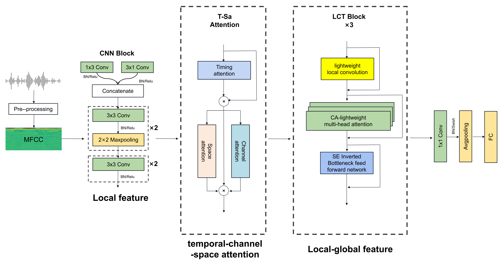

# Speech Emotion Recognition via CNN-Transformer and Multidimensional Attention Mechanism

## 📖 Introduction
This repository implements a Speech Emotion Recognition (SER) system using a hybrid ​​CNN-Transformer architecture​​ enhanced with a ​​Multidimensional Attention Mechanism​​.

## 🧠 Model Architecture
### 1. Overall Framework
  

### 🛠️ Installation

Clone the repository and create the conda environment:

```
git clone https://github.com/SCNU-RISLAB/CTMAM.git
cd CTMAM_SER_master

conda create -n CTMAM python=3.10
conda activate CTMAM
conda install pytorch==1.7.1 torchvision==0.8.2 torchaudio==0.7.2 cudatoolkit=10.2 -c pytorch
pip install -r requirements.txt
```

## 📂 Data Process
### IEMOCAP Dataset
```
python process_IEMPCAP.py
```

```
python process_Emodb.py
```

## 🚀 Training
### IEMOCAP Dataset
```
python train_IEMOCAP.py
```

```
python process_Emodb.py
```

## 📜 Citation
If you use this work in your research, please cite:

bibtex
@article{tang2025speech,
title={Speech emotion recognition via cnn-transformer and multidimensional attention mechanism},
author={Tang, Xiaoyu and Huang, Jiazheng and Lin, Yixin and Dang, Ting and Cheng, Jintao},
journal={Speech Communication},
pages={103242},
year={2025},
publisher={Elsevier}
}